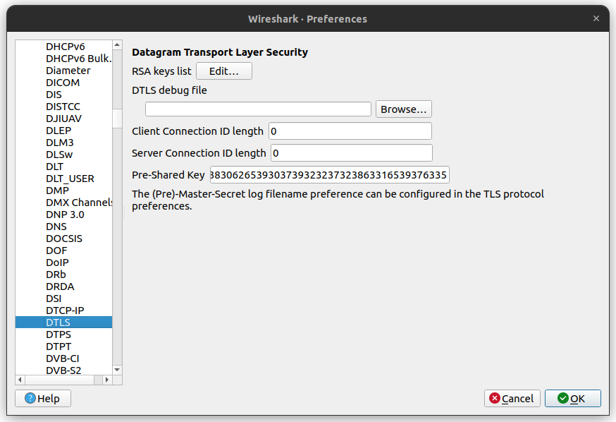

# CoAP PCAP

Exploring the [Constrained Application Protocol
(CoAP)](https://datatracker.ietf.org/doc/html/rfc7252) in
[Wireshark](https://www.wireshark.org/).

## Golioth Basics (PSK)

```
wireshark golioth_basics_psk.pcapng
```

The Golioth Basics (PSK) example uses the [Golioth
Basics](https://github.com/golioth/golioth-firmware-sdk/tree/main/examples/linux/golioth_basics)
program from the [Golioth Firmware
SDK](https://github.com/golioth/golioth-firmware-sdk) at
[v0.7.0](https://github.com/golioth/golioth-firmware-sdk/releases/tag/v0.7.0).

In order to decrypt CoAP messages, the pre-shared key must be supplied in hex
form. The following PSK can be used for the provided capture.

```
3639616631363835626139303830626539303739323237323863316539376335
```

It should be supplied in the **Pre-Shared Key** field in Wireshark under
**Edit > Preferences > Protocols > DTLS** as shown below.



To convert your own PSK to hex form, use the following command:

```
echo -n "YOUR_PSK_HERE" | xxd -ps -c 32
```
