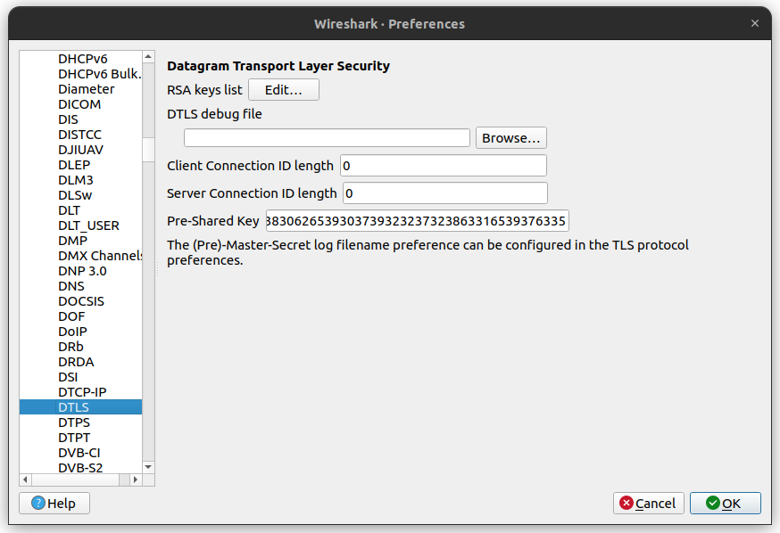

# CoAP PCAP

Exploring the [Constrained Application Protocol
(CoAP)](https://datatracker.ietf.org/doc/html/rfc7252) in
[Wireshark](https://www.wireshark.org/).

## Setup

Packet captures can be loaded into Wireshark with the following command:

```
wireshark <capture-name>.pcapng
```

If the capture is using a secure transport, such as DTLS / UDP, credentials must
be provided in order to decrypt the CoAP messages.

### Pre-Shared Keys

If the capture is using Pre-Shared Keys (PSK), the PSK must be supplied in hex
form in the **Pre-Shared Key** field in Wireshark under **Edit > Preferences >
Protocols > DTLS** as shown below.



If running your own capture, you may convert your PSK to hex form using the
following command:

```
echo -n "YOUR_PSK_HERE" | xxd -ps -c 32
```

## Captures

Captures included in this repository, along with any relevant information and
credentials, are detailed below.

### Golioth Basics (PSK)

```
wireshark golioth_basics_psk.pcapng
```

The Golioth Basics (PSK) example uses the [Golioth
Basics](https://github.com/golioth/golioth-firmware-sdk/tree/main/examples/linux/golioth_basics)
program from the [Golioth Firmware
SDK](https://github.com/golioth/golioth-firmware-sdk) at
[v0.7.0](https://github.com/golioth/golioth-firmware-sdk/releases/tag/v0.7.0).

PSK in hex:
```
3639616631363835626139303830626539303739323237323863316539376335
```

### Golioth OTA Download (PSK)

```
wireshark golioth_ota_download.pcapng
```

The Golioth OTA Download (PSK) uses the Golioth [CoAP
CLI](https://docs.golioth.io/reference/command-line-tools/coap/coap) to download
a firmware artifact. The exact command used is provided below.

```
coap --path /.u/c/main@1.0.0 --psk-id 20230614151602-linux@blush-unexpected-fox --psk 24685dc5f1b2276a8f43008e20c0be92 --host coap.golioth.io > artifact.bin
```

PSK in hex:
```
3234363835646335663162323237366138663433303038653230633062653932
```
